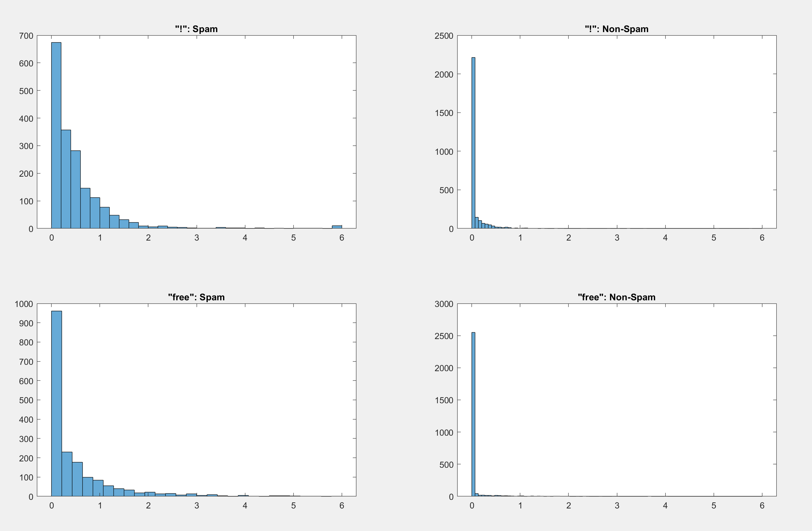
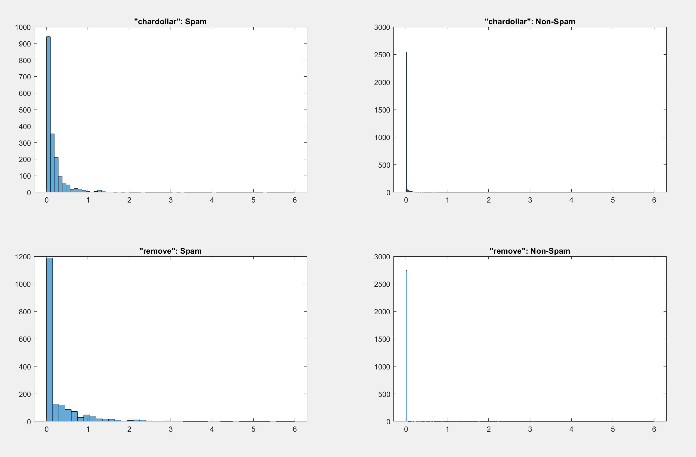
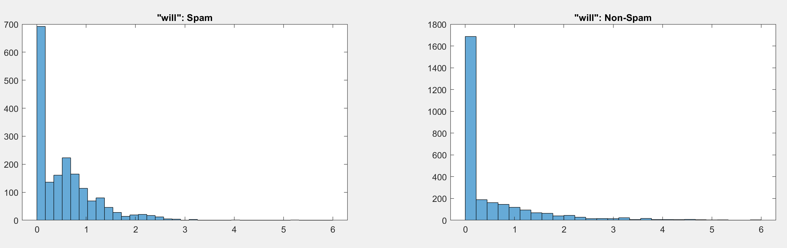

# Ergebnisse - by Bruno Fernandez
## Vorkommen einzelner Wörter in Mails

#### charExclamation - mit threshold 5:
|         | spam           | not spam  |
| ------------- |:-------------:| :-----:|
| charExclamation     | 13 | 5 |
| no charExclamation     | 1438 |  2225  |

#### charExclamation - mit threshold 3:
|         | spam           | not spam  |
| ------------- |:-------------:| :-----:|
| charExclamation     | 24 | 7 |
| no charExclamation     | 1427 |  2223  |

#### charExclamation - mit threshold 2:
|         | spam           | not spam  |
| ------------- |:-------------:| :-----:|
| charExclamation     | 49 | 10 |
| no charExclamation     | 1402 |  2220  |

#### charExclamation - mit threshold 0:
|         | spam           | not spam  |
| ------------- |:-------------:| :-----:|
| charExclamation     | 1210 | 598 |
| no charExclamation     | 241 |  1632  |

#### charExclamation - mit threshold 0.1:
|         | spam           | not spam  |
| ------------- |:-------------:| :-----:|
| charExclamation     | 1078 | 391 |
| no charExclamation     | 373 |  1839  |

Es ist zu sehen, dass mit einem zu hohen threshold zu viele Mails als false positive erkannt werden
Ich werde deshalb für die weiteren Schritte immer mit einem threshold von 0.1 arbeiten.
Lieber landet ein Spam im Posteingang statt umgekehrt
Ausserdem sind die Wörter welche am häufigsten in Spamnachrichten vorkommen charExclamation, free und will.
Deshalb werden wir nur mit diesen Wörtern weiter arbeiten.

#### free - mit threshold 0.1:
|         | spam           | not spam  |
| ------------- |:-------------:| :-----:|
| free     | 756 | 158 |
| no free     | 695 |  2072  |

#### will - mit threshold 0.1:
|         | spam           | not spam  |
| ------------- |:-------------:| :-----:|
| will     | 918 | 934 |
| no will     | 533 |  1296  |

## Wahrscheinlichkeit der Wörter
Für die Wahrscheinlichkeitsrechnung nehmen wir eine Spamwahrscheinlichkeit von 0.5 wie es im Aufgabenblatt beschrieben wurde.

### Bayes für charExclamation
|  charExclamation ist Spam | charExclamation ist NICHT Spam | Spam welches charExclamation beinhaltet | Nichtspam welches charExclamation beinhaltet |
| ------------- |:-------------:| :-----:|:-----:|
| 0.742935906271537 | 0.175336322869955 | 0.809058449873977 | 0.190941550126023 | 

### Bayes für free
|  free ist Spam | free ist NICHT Spam | Spam welches free beinhaltet | Nichtspam welches free beinhaltet |
| ------------- |:-------------:| :-----:|:-----:|
| 0.521019986216402 | 0.070852017937220 | 0.880291655222757 | 0.119708344777243 | 

### Bayes für remove
|  remove ist Spam | remove ist NICHT Spam | Spam welches remove beinhaltet | Nichtspam welches remove beinhaltet |
| ------------- |:-------------:| :-----:|:-----:|
| 0.352860096485183 | 0.014349775784753 | 0.960922140529477 | 0.039077859470523 | 

### Bayes für Kombination der Wörter

#### Bayes für charExclamation & free
|  Spam welches charExclamation & free beinhahltet |Nichtspam welches charExclamation & free beinhahltet|
| ------------- |:-----:|
|0.968904374066427|0.031095625933573|

#### Bayes für charExclamation & remove
|  Spam welches charExclamation & remove beinhahltet |Nichtspam welches charExclamation & remove beinhahltet|
| ------------- |:-----:|
|0.990493628136204|0.009506371863796|

#### Bayes für charExclamation, free & remove
|  Spam welches charExclamation, free & remove beinhahltet |Nichtspam welches charExclamation, free & remove beinhahltet|
| ------------- |:-----:|
|0.998696549620179|0.032051763991738|

